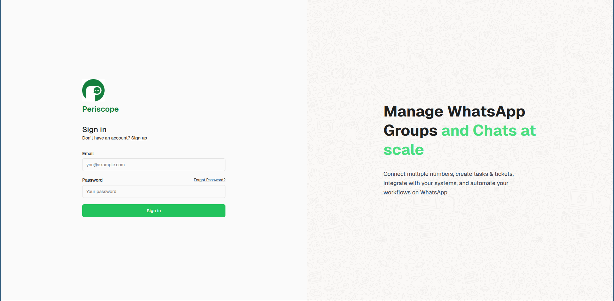
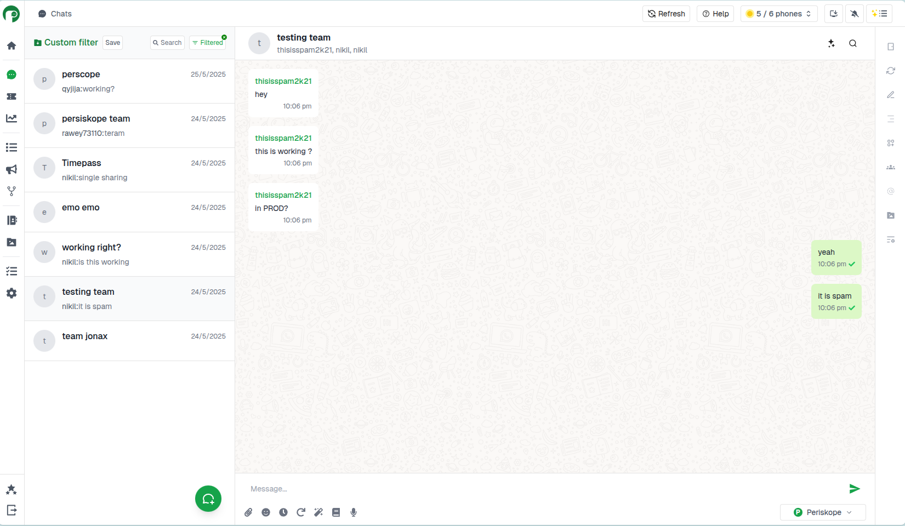

# Periskope Chat Application Assignment

A modern real-time chat application built with Next.js and Supabase, featuring a clean and intuitive user interface.

## Screenshots

### Login Page

*Clean and simple login interface with email/password authentication*

### Chat Interface

*Modern chat interface with sidebar navigation and real-time messaging*

Key Interface Features:
- Left sidebar for chat navigation
- Real-time message updates
- Clean message bubbles with sender identification
- Modern icons and UI elements
- Custom filters and search functionality
- Message composition area with multiple options

## Features

- **Real-time Chat**: Instant messaging with real-time updates
- **Group Conversations**: Create and manage group chats with multiple participants
- **User Search**: Easily find and add users to conversations
- **Message History**: View complete chat history with timestamps
- **Sender Identification**: Clear display of message senders in group chats
- **Modern UI**: Clean and responsive design with Tailwind CSS
- **Authentication**: Secure user authentication with Supabase

## Tech Stack

- **Frontend**: Next.js 
- **Backend/Database**: Supabase
- **Styling**: Tailwind CSS
- **Authentication**: Supabase Auth
- **Real-time**: Supabase Real-time subscriptions
- **Icons**: React Icons

## Getting Started

1. Clone the repository
2. Install dependencies:
   ```bash
   npm install
   ```

3. Set up your environment variables in `.env.local`:
   ```
   NEXT_PUBLIC_SUPABASE_URL=your_supabase_url
   NEXT_PUBLIC_SUPABASE_ANON_KEY=your_supabase_anon_key
   ```

4. Run the development server:
   ```bash
   npm run dev
   ```

5. Open [http://localhost:3000](http://localhost:3000) in your browser

## Database Schema

The application uses the following main tables in Supabase:

- **conversations**: Stores chat conversations
- **messages**: Stores individual messages
- **participants**: Manages conversation participants
- **profiles**: User profiles and display information

## Features in Detail

### Chat Interface
- Modern chat UI with message bubbles
- Sender identification in group chats
- Message timestamps
- Real-time message updates

### Message Composition
- Text input with send button
- Enter key support for sending messages
- Message status indicators

### User Experience
- Clean and intuitive interface
- Responsive design
- Easy navigation between chats
- User-friendly message display

## Security

- Secure authentication with Supabase
- Row Level Security (RLS) policies
- Protected API endpoints
- Secure user data handling


## License

This project is licensed under the MIT License - see the LICENSE file for details.
